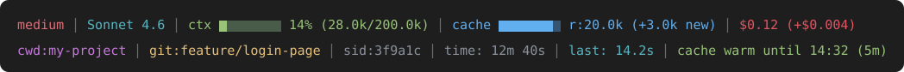

# Claude Code Status Line

[](https://github.com/KoltunovOleg/claude-code-statusline/releases)
[](LICENSE)


A two-line status line for [Claude Code](https://claude.com/claude-code) that shows the model, context usage, cache, cost, git branch and timing, plus a one-file installer for Windows, macOS and Linux.



| Field | Meaning |
|---|---|
| `medium` | Current effort level |
| `Sonnet 4.6` | Active model |
| `ctx` | Context window usage (green < 60%, yellow < 85%, red above) |
| `cache` | Cache reads vs. newly cached tokens |
| `$0.12 (+$0.004)` | Session cost (and cost of the last turn) |
| `cwd` / `git` | Current folder and git branch |
| `sid` | Short session ID |
| `time` | Session duration |
| `last` | Duration of the last model request |
| `cache warm until 14:32 (5m)` / `cache cold` | Whether the prompt cache is still warm, when it expires and its lifetime. When cold, the next request re-writes the cache and costs more |

## Install

Requires only Claude Code. Nothing else to install:

| OS | Installer | Runs with |
|---|---|---|
| Windows | `install-statusline.ps1` | PowerShell (built into Windows) |
| macOS / Linux | `install.sh` | bash (built into macOS and Linux) |

### Quick install

Downloads the installer and runs it. It still shows a preview and asks before changing anything.

**Windows** (PowerShell)
```powershell
[Net.ServicePointManager]::SecurityProtocol = 'Tls12'; irm https://raw.githubusercontent.com/KoltunovOleg/claude-code-statusline/main/install-statusline.ps1 -OutFile "$env:TEMP\install-statusline.ps1"; powershell -NoProfile -ExecutionPolicy Bypass -File "$env:TEMP\install-statusline.ps1"
```

**macOS / Linux** (terminal)
```bash
curl -fsSL https://raw.githubusercontent.com/KoltunovOleg/claude-code-statusline/main/install.sh | bash
```

### Manual install

Download the installer for your OS (or clone the repo), review it if you like, then run:

**Windows**
```powershell
powershell -NoProfile -ExecutionPolicy Bypass -File .\install-statusline.ps1
```

**macOS / Linux**
```bash
bash install.sh
```

On Windows, run it from PowerShell or Windows Terminal. Git Bash may not handle the y/n prompts.

### What the installer does

1. Checks that Claude Code is installed. If it isn't, it stops without creating anything.
2. If the status line script already exists, warns you and asks before replacing it. **No backup is made**, so copy the file yourself first if you want to keep it.
3. Shows a preview with sample data and asks whether to continue.
4. Writes the status line and runs a check to show the result.

If `settings.json` has an unexpected format, the macOS / Linux installer changes nothing and prints the snippet to add manually.

### Where it installs

| File | Change |
|---|---|
| `~/.claude/statusline.ps1` (Windows) or `~/.claude/statusline.sh` (macOS / Linux) | The status line script |
| `~/.claude/settings.json` | Only the `statusLine` entry is set. Other settings are kept. |

These are user-level settings, so the status line applies to **all projects** on the machine. Start a new Claude Code session to see it.

## Display notes

How the status line looks depends on your terminal, so it may differ slightly from the preview above:

- **Font.** Bars use the `▇` block character. Its height, and whether bar cells join seamlessly, depend on the terminal font. Fonts such as Cascadia Code, JetBrains Mono or Menlo render it best.
- **Colors.** The script uses 24-bit (true color) ANSI codes. Windows Terminal, VS Code, iTerm2 and most modern terminals support them. Older terminals, such as the legacy Windows console or macOS Terminal.app, show approximate colors.
- **Line spacing.** The gap between the two lines is controlled by the terminal, not the script (e.g. `terminal.integrated.lineHeight` in VS Code, **Line height** in Windows Terminal).
- **Background.** Colors are tuned for dark and blue (PowerShell) backgrounds. On light themes some fields may look pale.

Some values also depend on the session:

- `medium` (effort) appears only when Claude Code reports an effort level.
- `cache` shows `r:0` on the first request of a session, because everything is being written to the cache for the first time.
- `last` appears after the first model request.
- `cache warm` / `cache cold` needs Claude Code v2.1.251 or later and appears after the first model request. Claude Code refreshes the status line when the cache expires, so it switches to `cold` on its own.
- Cost and timing are tracked with small files in the system temp folder (`claude_*`), which the OS cleans up over time.

## Uninstall

Remove the `statusLine` entry from `~/.claude/settings.json` (or restore your own backup) and delete `~/.claude/statusline.ps1` (Windows) or `~/.claude/statusline.sh` (macOS / Linux).

## License

[MIT](LICENSE)
